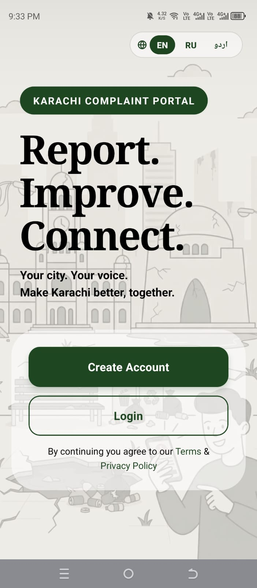
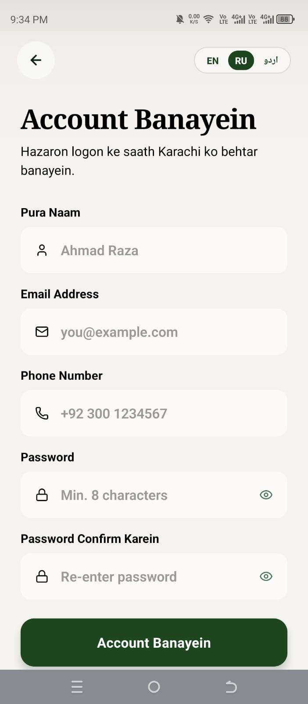
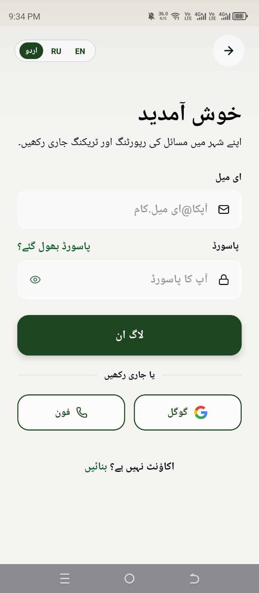
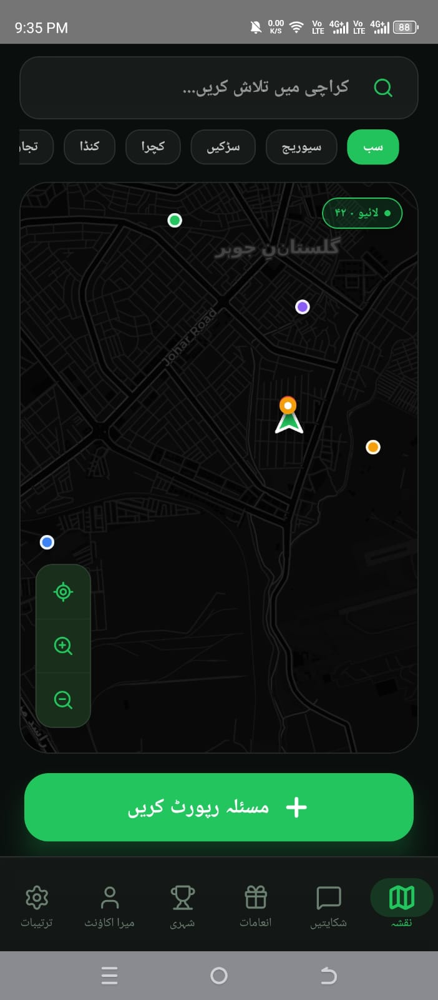
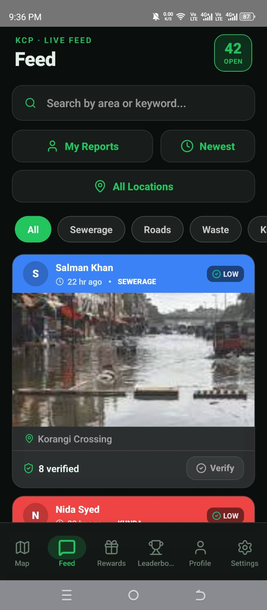
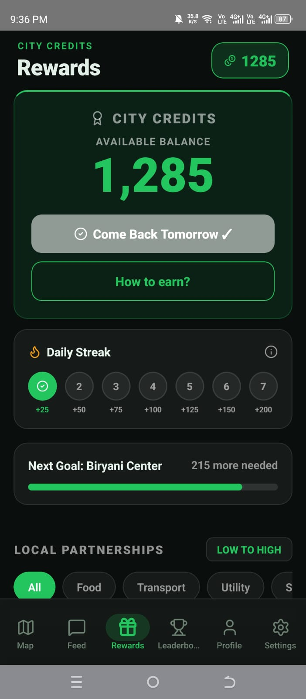
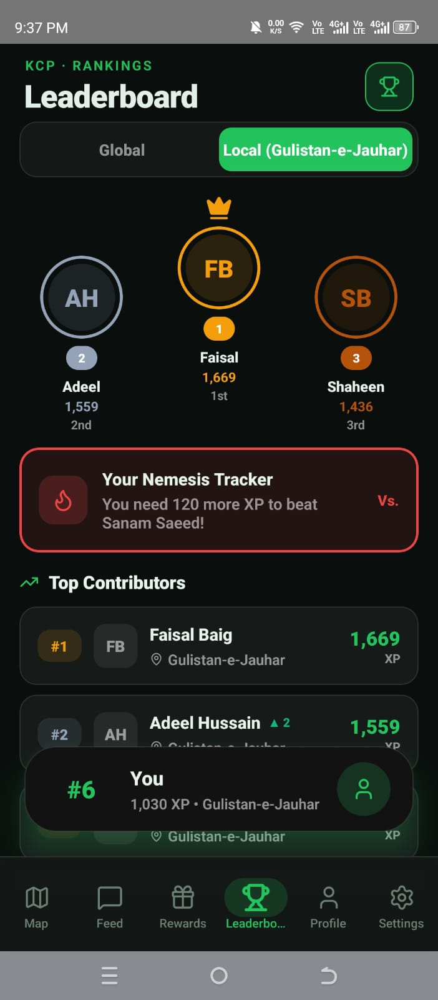
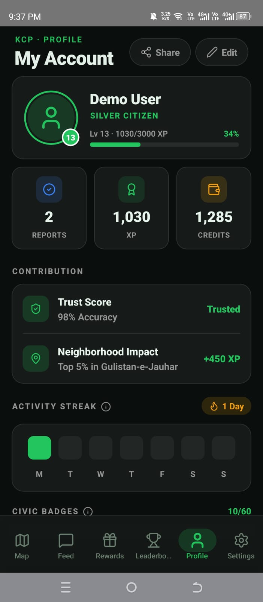
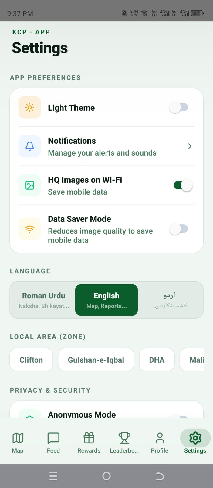

# 🏙️ Karachi Complaint Portal

> A React Native mobile application enabling Karachi citizens to report and track civic infrastructure issues with GPS mapping, photo evidence, and real-time updates.

---

## 📸 App Preview

<p align="center">
  
  
  
</p>
<p align="center">
  
  
  
</p>
<p align="center">
  
  
  
</p>

*(Note: Not all app features and screens are shown above due to space limitations. Please run the app to explore the full experience!)*

---

## 📱 Features

- **📍 Real-Time Map** — Report and view complaints on an interactive GPS-pinned map (Leaflet.js via WebView)
- **📷 Photo Evidence** — Attach compressed photo evidence to every report
- **🔐 Authentication** — Email/Password, Phone OTP, and Google Sign-In via Firebase Auth
- **🌍 Multilingual** — Full support for English, Urdu (اردو), and Roman Urdu
- **🏆 Gamification** — XP points, citizen ranks & badge reward system
- **🔔 Push Notifications** — Scheduled reminders via Notifee with boot-persistence
- **🌙 Dark / Light Mode** — System-aware theme switching
- **📶 Offline Support** — Firestore offline persistence for low-connectivity areas

---

## 🗂️ Complaint Categories

| Category | Description |
|---|---|
| 🛣️ Road Damage | Potholes, broken roads, pavement issues |
| 🚰 Sewage | Open drains, sewage overflow |
| 🗑️ Waste | Illegal dumping, garbage accumulation |
| 🏗️ Encroachment | Illegal structures on public land |
| ⚡ Kunda (Electricity) | Illegal power connections |

---

## 🛠️ Tech Stack

| Layer | Technology |
|---|---|
| Frontend | React Native (Android) |
| Backend | Firebase (Serverless) |
| Database | Cloud Firestore (NoSQL) |
| Auth | Firebase Authentication |
| Storage | Firebase Cloud Storage |
| Maps | Leaflet.js via WebView |
| Notifications | Notifee |
| State Management | React Context API |
| Navigation | React Navigation v6 |
| Internationalisation | i18next |

---

## 🚀 Getting Started

### Prerequisites
- Node.js 18+
- Android Studio + Android SDK
- Java Development Kit (JDK 17)
- React Native CLI

### Installation

```bash
# Clone the repository
git clone https://github.com/syedhaziqzia/Karachi-Complaint-Portal.git
cd Karachi-Complaint-Portal

# Install dependencies
npm install
```

### Firebase Setup (Required)

This project uses Firebase. You need to connect your own Firebase project:

1. Go to [Firebase Console](https://console.firebase.google.com) → Create a new project
2. Add an Android app with package name `com.firstapp`
3. Download `google-services.json` and place it at `android/app/google-services.json`
4. Enable **Authentication** (Email, Phone, Google)
5. Enable **Firestore Database**
6. Enable **Cloud Storage**

> ⚠️ **CRITICAL REQUIREMENT:** `google-services.json` is excluded from this repo for security. You must supply your own. **The app will crash natively on boot if you do not connect your own Firebase project.** Firebase is strictly necessary for this app to launch, authenticate users, and load the main feed.

### Running the App

```bash
# Start Metro bundler
npm start

# Run on Android (in a separate terminal)
npm run android
```

### 🛑 Important Note on Demo Data & Firebase Connections

Certain hardcoded demo data arrays have been temporarily disabled in the source code. This was done to ensure the app pulls real data from your Firebase instance rather than relying on dummy information.

**Files & Lines Modified:**
- **Leaderboard Screen** (`src/screens/main/TopShehriScreen.js`): Lines 27-118 (`GLOBAL_LEADER_POOL`) and Lines 124-153 (`LOCAL_LEADER_POOL`)
- **Rewards Screen** (`src/screens/main/InaamScreen.js`): Lines 476-478 (`areas` array)

- **Will the app still run?** Yes! Assuming you have properly connected Firebase as required above, the UI logic is designed to fall back gracefully. The leaderboard will simply display the active user without the dummy celebrities, and the rewards screen will use default fallbacks for community goals.
- **How to connect real data smoothly?** I have left step-by-step `TODO (Firebase Connection)` comments directly above the disabled code in those files. These comments provide the exact `useState` and `useEffect` code snippets needed to fetch this data from your own Firestore collections and populate the UI smoothly.

---

## ⚙️ System Constraints & Rules

### 📋 Reporting Rules
- **Photo mandatory** — every complaint submission requires an attached photo as evidence
- **GPS location mandatory** — the user's live coordinates must be acquired before submitting
- **Daily limit: 10 reports per user** — enforced in real-time via a Firestore `rate_limits` collection; the 11th attempt is blocked with a "Daily Limit Reached" modal
- **Text limits** — descriptions capped at 1,000 characters; location names at 200 characters; bug reports at 2,000 characters
- **Name validation** — display name must be 2–50 characters on registration

### 🗺️ Duplicate Prevention
- **Proximity duplicate check** — if another report of the same category exists within ~30 minutes of the submitted coordinates, the new submission is blocked
- **Self-duplicate block** — if the *same user* already has an active (non-resolved) report at the same spot, they are shown a "You already reported this" modal and blocked
- **Redirect to verify** — when a nearby duplicate exists from a *different* user, the app redirects the reporter to verify that existing report instead of creating a new one

### ✅ Verification System
- **Anyone can verify** a complaint *except* the original reporter
- **One verification per user per report** — enforced by checking `verifiedBy[]` array for both `userId` and `deviceId`
- **Rewards per verification** — 25 XP + 25 City Credits per verified report
- **Milestone bonuses for reporters** — when a report reaches 10/20/30 verifications, the original reporter earns bonus City Credits (150 / 75 / 25)

### 🛡️ Anti-Cheat Measures
- **Device ID binding** — a unique device ID is generated per installation and stored in AsyncStorage; complaints carry this ID
- **Same-device block** — a user cannot verify a complaint that was submitted from the same physical device, even if logged into a different account
- **User ID block** — a user cannot verify their own reports regardless of device
- **Duplicate device in `verifiedBy`** — before granting verification XP, the app checks both `userId` and `deviceId` against the full `verifiedBy` array
- **Rate limit document** — each submission writes to `rate_limits/{userId}` in Firestore so the daily cap persists across app restarts and devices
- **Owner-only deletion** — `removeComplaint` checks `complaint.userId === user.id` before allowing deletion; mismatches are logged and rejected
- **Cross-user save guard** — AppContext blocks saving state to Firestore if the loaded user ID does not match the currently signed-in user ID, preventing data contamination on account switches
- **Input sanitization** — all user-supplied text fields are stripped through `sanitizeText()` before being written to Firestore

### 🏆 XP, Levels & Ranks

| Action | XP Earned |
|---|---|
| Submit a complaint | +250 XP |
| Verify a complaint | +25 XP |
| Daily streak claim | +25 to +200 XP (Day 1–7) |

| Level Range | Rank Title |
|---|---|
| 1–4 | New Citizen |
| 5–9 | Active Shehri |
| 10–19 | Community Guardian |
| 20–34 | Civic Leader |
| 35–49 | Elite Citizen |
| 50+ | City Legend |

Each level requires 25% more XP than the previous one (starts at 500 XP).

### 🎖️ Badge System
60 badges across categories including streak milestones (7, 14, 30, 50, 100 days), complaint counts per category, XP thresholds, verification counts, and time-based achievements. All badges are computed dynamically from live Firestore data — no manual grants.

### 🎁 City Credits & Rewards
- Credits are earned through reports, verifications, streaks, and verification milestones
- Credits are spent on partner vouchers across 5 categories: Food, Transport, Utility, Shopping, Entertainment
- **Community vouchers** are tailored by neighbourhood socio-economic tier (Rich / Middle / Poor areas show different civic contribution goals)
- **7-day streak system** — claiming the streak once per day advances the counter; missing a day resets it to Day 1

---

## 📁 Project Structure

```
KarachiComplaintPortal/
├── src/
│   ├── context/          # AuthContext, AppContext, ThemeContext, etc.
│   ├── screens/
│   │   ├── auth/         # Login, SignUp, ForgotPassword, OTP
│   │   └── main/         # Map, Complaints, Account, Rewards, etc.
│   ├── components/       # Reusable UI components
│   ├── navigation/       # Auth & Main navigators
│   ├── services/         # NotificationService
│   ├── i18n/             # Translations (EN, UR, RU)
│   ├── hooks/            # Custom hooks (useBadges, etc.)
│   ├── theme/            # Colors & design tokens
│   └── utils/            # Validation helpers
├── android/              # Android native project
├── .gitignore
└── package.json
```

---

## 🔐 Security

- No API keys or credentials are hardcoded in source code
- `google-services.json` and `keystore.properties` are excluded via `.gitignore`
- Firebase Security Rules enforce user-scoped read/write access
- Passwords are never stored — handled entirely by Firebase Auth

---

## 📄 License

This project is licensed under the MIT License — see [LICENSE](LICENSE) for details.
