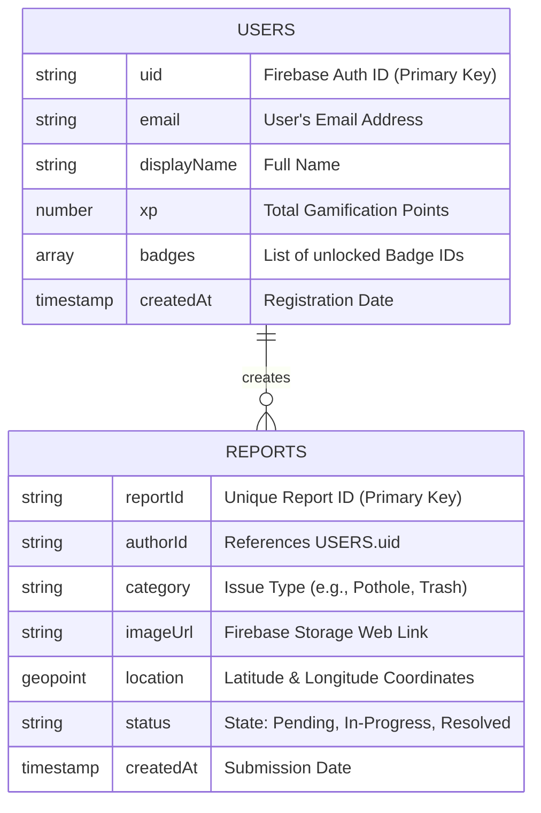
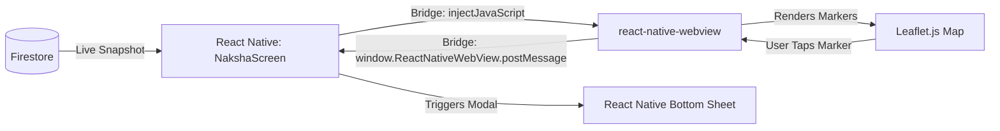
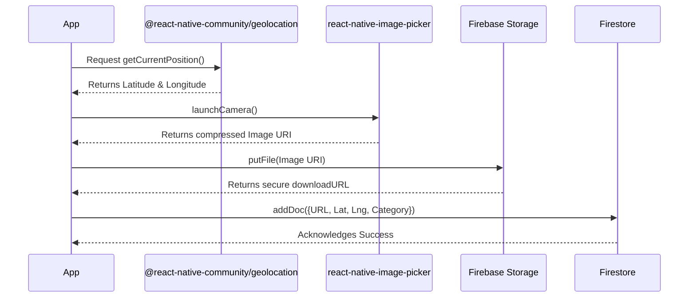
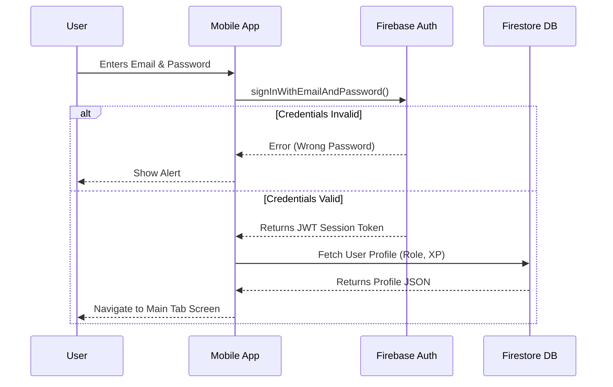

# FirstApp: The Complete Viva & Presentation Guide
*(Final Comprehensive Version: Simple Words, Maximum Detail, Bullet Points, Live Diagrams, and UI Screenshots)*

**Instructions for Slide/Document AI Agent:** 
*   *Please read this entire document carefully.*
*   *Convert the bullet points into clean, professional presentation slides.*
*   *Wherever you see a block labeled `[AI Diagram Prompt: ...]`, you can use the provided Mermaid diagram code to render visuals, or generate your own visual diagram (flowchart, sequence, or ER diagram) for that specific slide.*

---

## 1. Project Overview (The Big Picture)

### The Problem in the City
*   **Invisible Issues:** Citizens see broken roads, trash, and water leaks, but lack a clear way to report them.
*   **Hard to Report:** Calling local government is slow. Emails are often unmonitored.
*   **No Tracking:** Citizens do not know if their complaint was registered or if others are facing the same issue.

### The FirstApp Solution
*   FirstApp is a smart mobile app that turns every citizen into a "City Helper" (Shehri).
*   **Snap & Send (Shikayat):** Users take a photo of a problem, and the app automatically grabs their GPS location to report it instantly.
*   **Public Map (Naksha):** Everyone can see all active reports live on an interactive city map.
*   **Rewards Program (Inaam):** Helping the city is treated like a game. Users earn "XP" points and Badges to stay motivated.
*   **Accessibility:** Native support for both English and Urdu (using the `i18next` library) so everyone can use it.

---

## 2. File & Folder Structure (Where the Code Lives)

**[AI Diagram Prompt: Generate a tree diagram showing the folder structure of the app.]**

```mermaid
graph TD
    Root[App.js (Global Providers)] --> Nav[src/navigation/]
    Nav --> AuthNav[AuthNavigator.js]
    Nav --> MainNav[MainTabNavigator.js]
    Root --> Screens[src/screens/]
    Screens --> N[NakshaScreen.js]
    Screens --> S[ShikayatScreen.js]
    Screens --> I[InaamScreen.js]
    Screens --> T[TopShehriScreen.js]
    Screens --> M[MeraAccountScreen.js]
    Screens --> Settings[TarjeehatScreen.js]
    Root --> Context[src/context/]
    Context --> L[LanguageContext.js]
```

*   `App.js`: The root file. It starts the app and loads the global settings (Theme Context, Auth Context, Language Context).
*   `src/navigation/`: 
    *   `AuthNavigator.js`: Handles screens before login (Login, Signup, OTP). Uses React Navigation Stack.
    *   `MainTabNavigator.js`: The Bottom Tab bar shown *after* a successful login.
*   `src/screens/`: Contains the 6 main screens of the application.
    *   `NakshaScreen.js`: Shows the live interactive map using a WebView.
    *   `ShikayatScreen.js`: The camera and issue reporting form.
    *   `InaamScreen.js`: Shows the user's current XP and unlocked badges.
    *   `TopShehriScreen.js`: A list (Leaderboard) showing the users with the most points.
    *   `MeraAccountScreen.js`: User profile, showing their own submitted reports and details.
    *   `TarjeehatScreen.js`: App settings, including language toggling (English/Urdu) and theme options.
*   `src/context/`: Holds global data, like `LanguageContext.js` which swaps Urdu/English text everywhere dynamically without restarting the app.

---

## 3. System Architecture (How the App is Built)

**[AI Diagram Prompt: Generate a High-Level Architecture Flowchart.]**

```mermaid
flowchart TD
    %% User Side
    User((Citizen)) -->|Interacts| App[React Native App]
    
    %% Inside App
    subgraph Frontend: Mobile Device
        App --> Map[react-native-webview: Leaflet Map]
        App --> GPS[@react-native-community/geolocation]
        App --> Camera[react-native-image-picker]
        App --> Memory[AsyncStorage: Tokens & Theme]
    end
    
    %% Cloud Side
    subgraph Backend: Firebase Serverless
        App <-->|JWT Tokens| Auth[Firebase Authentication]
        App <-->|JSON Data| DB[(Firestore NoSQL Database)]
        App <-->|Blob Images| Storage[Firebase Cloud Storage]
    end
```

### The Two Main Parts of the App
*   **Frontend (The Phone App):** Built using **React Native**. This is what the user installs and interacts with. It allows one JavaScript codebase to compile into native code for both Android and iOS.
*   **Backend (The Cloud Engine):** Built using **Firebase** (Google's Serverless Platform). We don't build our own physical servers. Google handles all the database scaling, web sockets, and file storage.

### Core Libraries Used in Frontend (More Depth)
*   **Maps:** `react-native-webview` acts as a container to load a local HTML file running `Leaflet.js`.
*   **Camera:** `react-native-image-picker` allows access to the native iOS/Android camera and gallery.
*   **GPS Location:** `@react-native-community/geolocation` pings the device's GPS chip for exact Latitude and Longitude.
*   **Notifications:** `@notifee/react-native` generates local device push notifications when background events (like leveling up) occur.
*   **Localization:** `i18next` combined with `react-i18next` holds dictionaries for English and Urdu strings, swapping them based on `AsyncStorage` values.

---

## 4. Database Design (Where the Data Lives)

**[AI Diagram Prompt: Generate an Entity-Relationship (ER) Diagram showing the two main NoSQL collections.]**



*   **Technology Used:** We use **Firebase Firestore**, a highly scalable NoSQL cloud database.
*   **NoSQL Concept:** Instead of strict, rigid SQL tables (like MySQL), it saves data in flexible folders called "Collections". Each individual record is a JSON file called a "Document". This allows for unstructured, dynamic data (e.g., some reports can have extra fields without breaking the database).

---

## 5. Deep Dive: The 6 Main Screens (Features & Under-the-Hood Logic)

### A. NakshaScreen (Interactive Map)
 <!-- AI: Insert Map Screenshot here -->

**What it does & User Interaction (Buttons):**
*   **Map Interface:** Users can pan, zoom, and explore the city map.
*   **Marker Pins:** Users tap on a pin to view a summary of a reported issue in that location.
*   **Bottom Sheet (Details Modal):** After tapping a marker, a modal slides up displaying the photo, category, and status of the report.

**How it works underneath:**
**[AI Diagram Prompt: Generate a Flowchart showing the Map Bridge architecture.]**

*   React Native lacks a highly customizable, free built-in map. We embed a mini web-browser (`WebView`) running **Leaflet.js** via local HTML.
*   **Data Fetch:** App downloads a list of all active city reports from Firestore.
*   **The Bridge (Native to Web):** App converts the Firestore list into a JSON string and pushes it into the WebView using `injectJavaScript`. The Leaflet script plots pins based on this data.
*   **The Bridge (Web to Native):** When a marker is tapped, Leaflet sends a stringified payload back to the native app using `window.ReactNativeWebView.postMessage()`. The native app parses it and triggers the React Native Bottom Sheet modal.

### B. ShikayatScreen (Report Submission)
 <!-- AI: Insert Report Screenshot here -->

**What it does & User Interaction (Buttons):**
*   **"Take Photo" Button:** Opens the device camera to snap a picture of the issue.
*   **"Choose from Gallery" Button:** Opens the device gallery.
*   **Category Dropdown:** Lets the user select the type of issue (Pothole, Trash, Water Leak, etc.).
*   **"Submit Report" Button:** Finalizes the form and uploads the data.

**How it works underneath:**
**[AI Diagram Prompt: Generate a Sequence Diagram for the Report submission flow.]**

*   **Location:** When opened, the app silently uses `@react-native-community/geolocation` to grab exact GPS coordinates.
*   **Camera/Image:** `react-native-image-picker` opens the camera. The image is aggressively compressed (e.g., from 15MB to 500KB) to save bandwidth.
*   **Storage:** The compressed photo is uploaded as a blob to **Firebase Cloud Storage**, returning a secure `downloadURL`.
*   **Database:** A new document is saved in the **Firestore** `REPORTS` collection containing the `downloadURL`, GPS `geopoint`, category string, and the user's `uid`.

### C. InaamScreen (Gamification & Rewards)
 <!-- AI: Insert Rewards Screenshot here -->

**What it does & User Interaction (Buttons):**
*   **XP Progress Bar:** Visually shows how close the user is to the next level.
*   **Badges Grid:** Displays locked (grayed out) and unlocked (colored) badges. Tapping a badge might show how to unlock it.

**How it works underneath:**
**[AI Diagram Prompt: Generate a Flowchart showing the Gamification Logic.]**

```mermaid
flowchart TD
    Report[Report Submitted] --> DB[Firestore User Document]
    DB -->|Updates xp field: +50| DB
    DB -->|Real-time onSnapshot| App[React Native Listener]
    App --> Alg{XP >= 500?}
    Alg -- Yes --> Unlock[Unlock Badge in Array]
    Unlock --> Notify[Notifee Push Notification]
    Alg -- No --> Wait[Wait for next action]
```

*   **Live Tracking:** An `onSnapshot` listener watches the user's document in Firestore via WebSocket.
*   **Earning Points:** Submitting a valid report triggers a cloud function or app logic that increments the user's `xp` field (e.g., +50 XP).
*   **Badge Unlock Algorithm:** The listener detects the new XP. If `newXP >= threshold`, it pushes a new Badge ID to the user's array in Firestore.
*   **Push Notifications:** When a new badge is detected in the listener payload, `@notifee/react-native` triggers a local push notification on the device ("Badge Unlocked!").

### D. TopShehriScreen (Leaderboard)
 <!-- AI: Insert Leaderboard Screenshot here -->

**What it does & User Interaction (Buttons):**
*   **Leaderboard List:** Displays a ranked list of top users in the city based on their XP.
*   **Pull-to-Refresh:** Pulling down on the list refreshes the data manually if needed.

**How it works underneath:**
*   **Database Query:** The screen connects to Firestore and runs a specific query on the `USERS` collection: `.orderBy('xp', 'desc').limit(50)`. 
*   **Performance Optimization:** By using `limit(50)`, we prevent downloading thousands of records, saving bandwidth and memory.
*   **Rendering:** Uses a React Native `<FlatList>` for high-performance rendering. `FlatList` only renders the rows currently visible on the screen (virtualization), ensuring smooth scrolling even on older phones.

### E. MeraAccountScreen (Profile & History)
 <!-- AI: Insert Profile Screenshot here -->

**What it does & User Interaction (Buttons):**
*   **Profile Details:** Shows the user's name, email, and avatar.
*   **My Reports Tab:** Displays a list of issues reported *only* by this user.
*   **Edit Profile Button:** Allows changing the display name or avatar.
*   **Logout Button:** Securely signs the user out of the app.

**How it works underneath:**
*   **User Data Retrieval:** Hooks into the global `AuthContext` to get the current user's `uid`.
*   **Filtered Query:** Queries the `REPORTS` collection where `authorId == currentUser.uid`. This ensures the user only sees their own data.
*   **Logout Process:** When Logout is tapped, it calls `firebase.auth().signOut()`. This invalidates the JWT token, removes the token from `AsyncStorage`, updates the `AuthContext`, and forces the navigation controller to snap back to the `AuthNavigator` (Login Screen).

### F. TarjeehatScreen (Settings & Preferences)
 <!-- AI: Insert Settings Screenshot here -->

**What it does & User Interaction (Buttons):**
*   **Language Toggle (English/Urdu):** A switch or set of buttons allowing the user to change the app language instantly.
*   **Theme Toggle (Light/Dark Mode):** A switch to invert app colors for night viewing.
*   **Notification Settings:** Toggles for enabling/disabling push notifications.

**How it works underneath:**
*   **Localization (`i18next`):** When the language toggle is pressed, `i18n.changeLanguage('ur')` is called. This immediately swaps the active dictionary globally. 
*   **Persistence (`AsyncStorage`):** The new language choice is simultaneously saved to `AsyncStorage` (e.g., `setItem('appLanguage', 'ur')`). When the app is closed and reopened, `App.js` reads this storage and boots up in Urdu.
*   **Context Re-render:** Both Theme and Language rely on React's Context API. Updating the state in the Provider forces every component subscribed to that Context (every text node, every background color) to re-render instantly without requiring an app restart.

---

## 6. Keeping the App Safe (Security & Edge Cases)

*   **Protection of Sensitive Keys (`.env`):** 
    *   *Security Note:* No passwords, API credentials, or Firebase config strings are ever hardcoded in the app files. They are securely injected during the build process using `.env` (Environment Variables) which are explicitly ignored by Git (`.gitignore`). 
*   **No Internet Connection (Offline First):** 
    *   **Offline Mode:** Firestore automatically caches the report text locally on the device. If the user is in a dead zone, the app functions normally. The moment the phone connects to WiFi or 4G, it syncs the cached data to the cloud silently.
*   **Massive Phone Photos (15MB+):** 
    *   **Image Compression:** Modern phones take massive photos that would waste bandwidth and cloud storage money. The app aggressively squeezes the photo down to around 500KB *before* uploading. 
*   **GPS Permissions Denied:** 
    *   **Safe Error Catching:** The app uses `try/catch` blocks. It will *not* crash if the user says "No" to location. It gracefully shows an alert explaining *why* location is needed to fix city issues and provides a shortcut to open the device settings.
*   **Hacking Passwords:** 
    *   **Google Security:** We never see, touch, or handle raw passwords in our code. Firebase Authentication hashes and encrypts them instantly. Even if the entire database was somehow downloaded by a hacker, the user accounts and passwords remain completely safe.

---

## 7. Technical Defenses (Why We Chose These Tools)

### Why React Native? (Instead of Native Java/Kotlin/Swift)
*   **Single Codebase Efficiency:** JavaScript code runs on both Android and iOS. This cuts development time, bug fixing, and costs completely in half compared to building two separate native apps.
*   **Fast Ecosystem:** Full access to thousands of NPM libraries (like `axios`, `moment`, `i18next`) speeds up feature delivery.

### Why Firebase? (Instead of a Custom Node.js/Python Server)
*   **Zero Server Maintenance:** Firebase is a Backend-as-a-Service (BaaS). Google automatically handles server crashes, security patching, and scales up seamlessly if millions of users join.
*   **Real-Time WebSocket Data:** Firestore uses WebSockets automatically. When a pothole report is made, it instantly appears on every other active user's map without requiring them to pull-to-refresh or write complex Socket.io logic.

### Why Context API? (Instead of Redux)
*   **Less Boilerplate:** Redux is powerful but requires hundreds of lines of complex setup code.
*   **Perfect Fit for Global State:** FirstApp only needs to share high-level global settings (Auth, Theme, Language). The native React Context API handles this cleanly without third-party overhead.

---

## 8. Comprehensive Viva Questions (Basic to Hard Level)

This section provides a wide range of questions the external examiner might ask, categorized by difficulty, along with the expected answers.

### Easy Level (Basic Knowledge)
**Q1: What technologies did you use to build this app?**
*   **Answer:** "We used React Native for the mobile frontend, allowing us to build for both Android and iOS simultaneously. For the backend, we used Firebase (Firestore for database, Auth for user management, and Storage for images)."

**Q2: What is the purpose of `App.js`?**
*   **Answer:** "It is the entry point of the application. It wraps the entire app in global providers (Contexts) for Authentication, Theme, and Language, and loads the main navigation container."

**Q3: How do you handle multiple languages (Urdu/English)?**
*   **Answer:** "We use the `i18next` library. It stores dictionaries of translated strings. We use React Context to provide the current language state to all components, and `AsyncStorage` to remember the user's choice upon restart."

### Medium Level (Implementation Details)
**Q4: How did you implement the map since React Native doesn't have a good built-in free map?**
*   **Answer:** "We used a clever workaround. We embedded a `react-native-webview` (a mini browser) on the `NakshaScreen`. Inside this WebView, we load a local HTML file running `Leaflet.js`, a popular web mapping library. We pass data back and forth using `injectJavaScript` and `postMessage`."

**Q5: Why did you choose Firebase Firestore over a traditional SQL database like MySQL?**
*   **Answer:** "Firestore is a NoSQL database. It's highly scalable and schema-less, which allows for fast iteration. Most importantly, it has built-in real-time listeners (`onSnapshot`), meaning if one user reports an issue, it instantly appears on another user's map via WebSockets without writing complex backend server code."

**Q6: What happens if a user tries to submit a report while offline?**
*   **Answer:** "Firestore has built-in offline persistence. The report data is saved locally on the device's cache. Once the device regains internet access, the Firebase SDK automatically syncs the cached data to the cloud."

**Q7: How do you ensure the app performs well when the leaderboard (`TopShehriScreen`) has thousands of users?**
*   **Answer:** "First, we optimize the database query using `.limit(50)` to only fetch the top 50 users. Second, on the UI side, we use React Native's `<FlatList>`, which uses virtualization—it only renders the rows that are currently visible on the screen, recycling memory as the user scrolls."

### Hard Level (Architecture, Security & Edge Cases)
**Q8: Explain the security mechanisms in your app. How are API keys protected, and are user passwords safe?**
*   **Answer:** "We do not hardcode any sensitive Firebase config keys in our GitHub repository; we use environment variables (`.env`) which are ignored by Git. As for passwords, we never handle them directly. Firebase Auth hashes and salts them securely on Google's servers. We only store secure JWT tokens locally using `AsyncStorage` for session management."

**Q9: Let's talk about the Web/Native Bridge for your Map. Can you explain the exact mechanism of how tapping a pin in the web map opens a React Native modal?**
*   **Answer:** "Inside the Leaflet.js HTML file, we add an `onClick` event listener to the marker. When triggered, it calls `window.ReactNativeWebView.postMessage(JSON.stringify(payload))`. On the React Native side, the `<WebView>` component has an `onMessage` prop. This prop receives the stringified payload, parses it into a JavaScript object, updates local state with the report details, and toggles the `isVisible` state of the Bottom Sheet modal to `true`."

**Q10: Your gamification system relies on `xp`. What stops a malicious user from editing their local app code or intercepting network requests to artificially inflate their `xp` to 1,000,000?**
*   **Answer:** "In a production environment, the client app should not directly write to the `xp` field in Firestore. Instead, the React Native app should trigger a secure **Firebase Cloud Function** when a report is submitted. The Cloud Function (running on the secure server) verifies the image and data, and *it* increments the `xp`. Additionally, Firestore Security Rules would be written to `allow update: if request.resource.data.xp == resource.data.xp` from the client side, strictly blocking any manual XP tampering by the user."

**Q11: How do you manage memory leaks in React Native, especially with real-time listeners?**
*   **Answer:** "When using Firebase's `onSnapshot` listener in a `useEffect` hook, it returns an `unsubscribe` function. We must return this `unsubscribe` function in the cleanup block of the `useEffect`. This ensures that when the user navigates away from the screen, the WebSocket listener is cleanly destroyed, preventing memory leaks and background battery drain."

---

## 9. Rewards System Logic & Anti-Cheating Mechanisms

### XP Points vs. City Credits
*   **XP (Experience Points):** Represents the user's lifetime contribution. Used to level up and unlock prestigious Badges (status markers). XP never decreases.
*   **City Credits:** A spendable virtual currency. Users earn these by helping the city and can potentially redeem them for civic perks (e.g., discounted public transit, parking passes). 

### Reporting vs. Verifying
*   **Reporting a New Issue:** Takes more effort. Yields high rewards (e.g., +50 XP, +10 City Credits).
*   **Verifying an Existing Issue:** Users can verify if a reported issue is still there or if it has been fixed. Takes less effort, yields lower rewards (e.g., +15 XP, +3 City Credits).

### Constraints & Anti-Cheating Mechanisms
To prevent users from gaming the system to farm XP, strict logical constraints are applied:
*   **200m Geofencing Limit:** You cannot verify or report an issue from your couch. The app calculates the distance between the user's live GPS coordinates and the issue's coordinates (using the Haversine formula). If the distance is > 200 meters, the submission is blocked.
*   **Daily Rate Limits:** To prevent spam, accounts are limited to submitting 5 new reports and 15 verifications per 24-hour period.
*   **Duplicate Radius Check:** When a user tries to report a pothole, the app checks if an active pothole report already exists within a 50m radius. If so, it prompts the user to "Verify" the existing report instead of creating a duplicate.
*   **Live Camera Enforcement:** For certain high-reward reports, gallery uploads are disabled. The user *must* take a live photo using the device camera.

---

## 10. Additional Advanced Viva Questions (25 Questions)

### React Native & Frontend
**Q12: Explain the difference between React and React Native.**
*   **Answer:** React is a library for building web interfaces using DOM elements (div, span). React Native is a framework that uses React to build mobile apps, compiling JavaScript down to native iOS and Android components (View, Text) instead of web elements.

**Q13: What is the Virtual DOM, and does React Native use it?**
*   **Answer:** React Native uses a similar concept to React's Virtual DOM to diff state changes, but instead of updating a browser DOM, it sends a batch of UI update commands over the "Bridge" to the native mobile UI threads.

**Q14: Explain the component lifecycle in React Native (using Hooks).**
*   **Answer:** With functional components, we use the `useEffect` hook to replicate lifecycle methods. Passing an empty array `[]` acts like `componentDidMount`. Returning a function acts like `componentWillUnmount`. Passing variables in the array acts like `componentDidUpdate`.

**Q15: What is Prop Drilling, and how did you avoid it?**
*   **Answer:** Prop drilling is passing data through many layers of components that don't need it, just to reach a deeply nested component. We avoided it by using the Context API for global state like Theme, Language, and Authentication.

**Q16: Why did you use `FlatList` instead of `ScrollView` for the Leaderboard?**
*   **Answer:** `ScrollView` renders all items at once, which would crash the app if there were 1,000 users. `FlatList` uses virtualization—it only renders the 10-15 items currently visible on the screen, saving memory.

**Q17: What does the `key` prop do in lists?**
*   **Answer:** It helps React identify which items have changed, been added, or been removed. It must be unique (like a database ID) to ensure efficient UI updates and prevent rendering bugs.

**Q18: How does navigation work in your app?**
*   **Answer:** We used React Navigation. We maintain a Stack Navigator for authentication flows (Login/Signup) and a Bottom Tab Navigator for the main app interface.

**Q19: What is `AsyncStorage` used for?**
*   **Answer:** It is an unencrypted, asynchronous, persistent, key-value storage system. We use it to store non-sensitive preferences like the selected language, theme, and the Firebase Auth persistence token so the user stays logged in.

**Q20: Explain the purpose of `useState` and `useEffect`.**
*   **Answer:** `useState` creates variables that, when changed, trigger the UI to re-render. `useEffect` is used to handle side-effects, like fetching data from the database or setting up event listeners when the screen loads.

**Q21: How do you handle styling in React Native?**
*   **Answer:** We use the `StyleSheet.create()` API, which is similar to CSS but uses camelCase properties (e.g., `backgroundColor`) and uses Flexbox by default for layout positioning.

### JavaScript & Logic
**Q22: What are Promises in JavaScript?**
*   **Answer:** A Promise represents the eventual completion (or failure) of an asynchronous operation. It allows us to use `.then()` and `.catch()` or `async/await` so the app doesn't freeze while waiting for database responses.

**Q23: What is the difference between `let`, `const`, and `var`?**
*   **Answer:** `const` is for variables that won't be reassigned. `let` is for block-scoped variables that will change. `var` is function-scoped and outdated; we strictly use `let` and `const` for predictable state.

**Q24: What is Arrow Function syntax and why use it?**
*   **Answer:** Arrow functions `() => {}` provide a shorter syntax and, importantly, do not bind their own `this` context, making them perfect for callbacks inside React components.

**Q25: How do you handle errors during an API or database call?**
*   **Answer:** We wrap our async database calls in `try...catch` blocks. If an error occurs (like no internet), execution jumps to the `catch` block where we show a user-friendly `Alert.alert()` instead of crashing the app.

**Q26: What is object destructuring?**
*   **Answer:** It's a syntax to unpack properties from objects into distinct variables. For example, `const { xp, badges } = userData;` instead of `const xp = userData.xp;`.

### Firebase & Backend
**Q27: How does Firebase Authentication manage sessions?**
*   **Answer:** When a user logs in, Firebase returns a secure JSON Web Token (JWT). Firebase's SDK automatically refreshes this token in the background and stores it securely, maintaining the session across app restarts.

**Q28: What is a NoSQL database?**
*   **Answer:** Unlike SQL databases which use strict tables and columns, NoSQL databases like Firestore store data as flexible JSON-like documents. This allows for rapid iteration and handling unstructured data.

**Q29: Explain the difference between `get()` and `onSnapshot()` in Firestore.**
*   **Answer:** `get()` fetches the data once. `onSnapshot()` opens a WebSocket connection and continuously listens for changes, updating the app instantly if the data changes on the server.

**Q30: How are images stored in Firebase?**
*   **Answer:** We use Firebase Cloud Storage. We upload the image as a BLOB, and Firebase returns a public download URL, which we then save inside the Firestore database record.

**Q31: What is a Firebase Cloud Function? (Conceptual)**
*   **Answer:** It's backend code triggered by database events. For anti-cheating, a Cloud Function could securely validate a report on Google's servers before awarding XP, preventing client-side hacking.

### Architecture, Security, & Features
**Q32: How did you implement Localization (English/Urdu)?**
*   **Answer:** Using `i18next`. We created JSON dictionaries for both languages. Wrapping the app in a Context Provider allows us to instantly swap the active dictionary, updating all text without reloading the app.

**Q33: How does the app get the user's location?**
*   **Answer:** We use `@react-native-community/geolocation`, which accesses the device's native GPS API to return highly accurate Latitude and Longitude coordinates.

**Q34: How did you calculate the distance between the user and an issue for the 200m limit?**
*   **Answer:** Since the earth is curved, we use the Haversine formula, a mathematical equation that calculates the shortest distance between two GPS coordinates over the earth's surface.

**Q35: What happens if the user denies camera or location permissions?**
*   **Answer:** The app handles this gracefully. It displays a UI message explaining that the feature requires permissions to function and provides a button to open the device settings.

**Q36: Why compress images before uploading?**
*   **Answer:** Phone cameras produce 10MB+ images. Uploading these would consume the user's mobile data, slow down the app, and increase our Firebase storage costs. Compressing to < 500KB optimizes all three.

---

## 11. Common Examiner Traps

Examiners often ask "trap" questions to see if you actually wrote the code or if you understand the underlying concepts.

*   **Trap 1:** *"Show me your SQL tables for the reports."*
    *   **Answer:** "We didn't use SQL tables. We used Firebase Firestore, which is a NoSQL database. We use Collections and Documents."
*   **Trap 2:** *"Where is your server running? Is it on Apache or Nginx?"*
    *   **Answer:** "We are entirely Serverless. Our backend relies on Firebase, which is fully managed by Google. We don't maintain traditional servers like Apache."
*   **Trap 3:** *"How do you decrypt the passwords in the database to check if a user is logging in correctly?"*
    *   **Answer:** "We don't. Passwords are one-way hashed by Firebase Auth. It is cryptographically impossible to decrypt them. Firebase handles the secure comparison internally during login."
*   **Trap 4:** *"Does your app run faster on Android because React Native is built by Facebook?"*
    *   **Answer:** "No, React Native performance is generally comparable on both platforms. It compiles JavaScript logic and maps it to native OS components (Java/Kotlin for Android, Swift/Obj-C for iOS)."
*   **Trap 5:** *"If I edit the source code on my phone to give myself 1,000,000 XP, how does your app stop me?"*
    *   **Answer:** "Client-side code can never be trusted. We use Firestore Security Rules and server-side validation to ensure that users cannot arbitrarily write or update protected fields like `xp`."

---

## 12. Firestore Security Rules Examples

Security rules determine who can read or write data to the database. Without rules, anyone with your config could delete the database.

```javascript
rules_version = '2';
service cloud.firestore {
  match /databases/{database}/documents {
    
    // USERS COLLECTION RULES
    match /USERS/{userId} {
      // Anyone logged in can read profile data
      allow read: if request.auth != null; 
      // Users can only edit their own profile, and CANNOT manually edit their XP
      allow update: if request.auth.uid == userId 
                    && !request.resource.data.keys().hasAny(['xp', 'badges']);
    }

    // REPORTS COLLECTION RULES
    match /REPORTS/{reportId} {
      // Anyone logged in can see reports on the map
      allow read: if request.auth != null;
      // Users can create a report, but the authorId must match their own ID
      allow create: if request.auth != null 
                    && request.resource.data.authorId == request.auth.uid;
    }
  }
}
```

---

## 13. Authentication & Login/Signup Flow Diagrams

### Authentication Architecture Diagram
**[AI Diagram Prompt: Generate a Sequence Diagram showing the Login flow.]**


---

## 14. Testing Methodology & Results

*   **Unit Testing Setup:** (If applicable) Testing utility functions like the Haversine formula logic or language switching logic.
*   **Manual UI Testing:** 
    *   Tested layout on small screens and large screens to ensure Flexbox wrapping works.
    *   Tested the app in both Light and Dark modes to ensure text remains readable.
    *   Tested the language toggle to ensure all UI elements translate properly without clipping.
*   **Field Testing (Real-World Conditions):**
    *   *GPS Accuracy Test:* Walked outside to verify location markers plot accurately on the map.
    *   *Low Network Test:* Simulated 3G networks to test image compression and upload times.
    *   *Offline Test:* Turned off WiFi to verify that Firestore successfully caches reports locally.

---

## 15. Performance Optimization Techniques

*   **Image Compression:** Reducing 15MB camera photos to ~500KB before upload drastically saves time and cloud bandwidth.
*   **Virtualization (`FlatList`):** Used `FlatList` for the Leaderboard and History screens so the app only renders data currently on the screen, preventing memory crashes.
*   **Query Limiting:** Added `.limit(50)` to the Leaderboard database fetch to prevent downloading thousands of unused user records.
*   **Component Memoization (React.memo):** (If used) Prevents complex components from re-rendering unless their specific props change.
*   **Selective Re-rendering:** Grouped Context Providers efficiently so that changing a text input doesn't cause the Map WebView to re-render.

---

## 16. Project Limitations & Future Enhancements

### Current Limitations
*   **No Dedicated Admin Panel:** Currently, there is no web dashboard for city officials to easily manage, assign, or mark reports as "Fixed" from a desktop.
*   **Dependence on Google:** The entire backend is tied to Firebase. Migrating away would require a complete backend rewrite.
*   **Battery Usage:** Frequent GPS polling and live map rendering can drain the battery on older devices.

### Future Enhancements
*   **AI Image Verification:** Implementing an AI model to analyze uploaded photos and automatically detect if it's a real pothole vs. a picture of a wall, preventing spam.
*   **Civic Dashboard:** Building a React.js web portal for the municipal government to track analytics, heatmaps of issues, and update report statuses.
*   **Social Sharing:** Allow users to share a reported issue directly to WhatsApp or Twitter to raise awareness.
*   **Crowdfunding/Donations:** Allowing citizens to pool funds to fix minor community issues faster than the city can.

---

## 17. Common Bugs Encountered & Fixes

*   **Bug 1: WebView Map Not Loading on Android.**
    *   *Cause:* Android blocks local unencrypted HTML files in WebView by default.
    *   *Fix:* Configured the `originWhitelist={['*']}` prop on the WebView and ensured the URI path was properly formatted for Android assets.
*   **Bug 2: Memory Leak Warning ("Can't perform a React state update on an unmounted component").**
    *   *Cause:* Setting state after a Firebase async call finished, but the user had already navigated away from the screen.
    *   *Fix:* Used a boolean flag `let isMounted = true;` inside `useEffect` and checked it before calling `setState`, or properly unsubscribed from the Firebase listener.
*   **Bug 3: UI Text Overflowing in Urdu.**
    *   *Cause:* Urdu strings are often longer or require different line-heights than English strings, breaking the Flexbox layout.
    *   *Fix:* Added dynamic styling based on the active language (using Context) and wrapped text in `ScrollView` or used `flexShrink: 1`.
*   **Bug 4: Keyboard Covering Input Fields.**
    *   *Cause:* The native virtual keyboard slides up over the text inputs on smaller screens.
    *   *Fix:* Wrapped the Auth and Report forms in a `KeyboardAvoidingView` with platform-specific behavior (`padding` for iOS, `height` for Android).

---

## 18. One-Page Architecture Summary (The 2-Minute Pitch)

*(Use this if the examiner asks: "Summarize your entire project in 2 minutes")*

"FirstApp is a **React Native** mobile application designed to crowdsource city maintenance. 

On the **Frontend**, the app uses **React Navigation** to route users between features. We implemented a custom interactive map using a **WebView bridge to Leaflet.js**, allowing citizens to view live city issues. When a user reports an issue, the app utilizes native device APIs: **react-native-image-picker** for the camera and **geolocation** to pinpoint exact coordinates. To ensure accessibility, the app dynamically switches between English and Urdu using **i18next** and React Context.

On the **Backend**, we utilize a fully serverless architecture powered by **Firebase**. Authentication is handled securely via **Firebase Auth**. The main data (users and reports) is stored in **Firestore**, a NoSQL database that pushes real-time WebSocket updates to the map. Images are compressed on the device and uploaded as blobs to **Firebase Cloud Storage**.

To motivate users, we built a gamification engine enforcing strict anti-cheating constraints—like a **200-meter GPS geofence**—using the Haversine formula. When valid reports are made, users earn XP, unlocking badges and climbing a virtualized **FlatList leaderboard**. 

Overall, the architecture was chosen to maximize cross-platform code reuse, ensure real-time data sync with zero server maintenance, and provide a smooth, engaging user experience."
